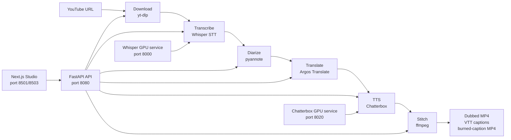

# Foreign Whispers

[](./LICENSE)

Foreign Whispers is an open-source YouTube dubbing pipeline for turning
English videos into Spanish dubbed videos using local components: `yt-dlp`,
Whisper, pyannote, Argos Translate, Chatterbox TTS, and ffmpeg. This fork
completes the course project pipeline from download through stitched dubbed
video, adds diarization and per-speaker voice routing, improves timing quality,
and includes final submission artifacts generated on a Lightning AI NVIDIA L4
GPU machine.

## Submission Summary

Author: Arda Dinc

Team: Arda Dinc (solo submission)

Branch: `codex/foreign-whispers-completion`

Final artifact configuration: `c-abc1234`

The generated media artifacts are intentionally not committed to Git because
they are large MP4/WAV files. The final dubbed videos, burned-caption videos,
sidecar VTT captions, and proof JSON artifacts are stored in the submitted
Google Drive folder:

```text
https://drive.google.com/drive/folders/1QI-KmpJiXlapbkBbY8zQdSQ2x5mWWBy4?usp=sharing
```

Submission artifact folder: [Foreign Whispers final artifacts](https://drive.google.com/drive/folders/1QI-KmpJiXlapbkBbY8zQdSQ2x5mWWBy4?usp=sharing)

Final generated videos:

- `Alysa Liu: The 60 Minutes Interview`
- `Rob Reiner: The 60 Minutes Interview`
- `Military Drones: 60 Minutes Full Episodes`
- `Strait of Hormuz disruption threatens to shake global economy`

Final artifact locations on the GPU machine:

```text
pipeline_data/api/dubbed_videos/c-abc1234/*.mp4
pipeline_data/api/dubbed_videos/c-abc1234_burned/*.mp4
pipeline_data/api/dubbed_captions/*.vtt
pipeline_data/api/transcriptions/whisper/*.json
pipeline_data/api/diarizations/*.json
pipeline_data/api/translations/argos/*.json
pipeline_data/api/tts_audio/chatterbox/c-abc1234/*.wav
pipeline_data/api/tts_audio/chatterbox/c-abc1234/*.align.json
```

The externally submitted copies of these artifacts are available here:
[Google Drive artifact folder](https://drive.google.com/drive/folders/1QI-KmpJiXlapbkBbY8zQdSQ2x5mWWBy4?usp=sharing).

Validation checkpoint:

```text
Targeted backend tests: 41 passed
Frontend lint/build: passed locally
GPU pipeline: completed for four videos through final stitched MP4
```

## What Was Built

The completed pipeline performs:

1. Download a YouTube video and available captions.
2. Transcribe the audio with Whisper.
3. Run speaker diarization with pyannote.
4. Merge speaker labels into the Whisper transcript.
5. Translate English segments into Spanish with Argos Translate.
6. Preserve timestamps and speaker metadata through translation.
7. Repair old cached translations if speaker metadata is missing.
8. Generate Spanish speech using Chatterbox TTS.
9. Route TTS through per-speaker reference voices when speaker labels exist.
10. Align generated TTS audio to original segment timing.
11. Stitch the dubbed audio back into the original video with ffmpeg.
12. Generate sidecar WebVTT captions.
13. Generate burned-caption MP4s for unambiguous grading playback.

The main goal was not just to produce one successful video, but to make the
pipeline reproducible and defensible at every assignment stage.

## Architecture



Runtime services:

| Layer | Component | Role |
| --- | --- | --- |
| Frontend | Next.js Dubbing Studio | User interface, settings, pipeline table, video playback |
| API | FastAPI | Orchestrates pipeline stages and caches artifacts |
| STT GPU | Speaches/Whisper | Speech-to-text inference |
| TTS GPU | Chatterbox | Spanish speech synthesis and voice cloning |
| Library | `foreign_whispers` | Alignment, diarization merge, reranking, evaluation utilities |
| Media tools | ffmpeg | Audio extraction, remuxing, burned captions |

## Quick Start

Create `.env`:

```bash
FW_HF_TOKEN=hf_your_token_here
```

Start the NVIDIA stack:

```bash
docker compose --profile nvidia up -d
```

Verify services:

```bash
curl http://localhost:8080/healthz
curl -s http://localhost:8020/health
docker compose ps
```

Open the frontend:

```text
http://localhost:8501
```

On Lightning AI, the exposed frontend port was:

```text
8503
```

## Pipeline Commands

Example for one video:

```bash
VIDEO_ID=6O3HLPWatuU
CONFIG=c-abc1234

curl -X POST http://localhost:8080/api/download \
  -H "Content-Type: application/json" \
  -d "{\"url\":\"https://www.youtube.com/watch?v=$VIDEO_ID\"}"

curl -X POST http://localhost:8080/api/transcribe/$VIDEO_ID
curl -X POST http://localhost:8080/api/diarize/$VIDEO_ID
curl -X POST http://localhost:8080/api/translate/$VIDEO_ID
curl -X POST "http://localhost:8080/api/tts/$VIDEO_ID?config=$CONFIG&alignment=true"
curl -X POST "http://localhost:8080/api/stitch/$VIDEO_ID?config=$CONFIG"
```

Audit generated stage outputs:

```bash
find pipeline_data/api/transcriptions/whisper -type f -name "*.json"
find pipeline_data/api/diarizations -type f -name "*.json"
find pipeline_data/api/translations/argos -type f -name "*.json"
find pipeline_data/api/dubbed_videos/c-abc1234 -type f -name "*.mp4"
find pipeline_data/api/dubbed_captions -type f -name "*.vtt"
```

## Assignment Task Mapping

### Notebook 1: Download Integration

Status: complete.

The download stage uses `yt-dlp` to fetch source MP4 files and YouTube captions.
The downloaded artifacts are cached under:

```text
pipeline_data/api/videos/
pipeline_data/api/youtube_captions/
```

Issue encountered:

- The container accidentally saw `/app/cookies.txt` as a directory because of a
  bind-mount/cookie-file mismatch.

Fix:

- `download_engine.py` now only passes a cookie file to `yt-dlp` when the path is
  actually a file, not merely when it exists.

### Notebook 2: Transcription Integration

Status: complete.

Whisper transcription was run for all four final videos. The pipeline uses
Whisper output as the canonical downstream segment format because it provides
the timing structure needed for diarization merge, translation, alignment, TTS,
and captions.

Output:

```text
pipeline_data/api/transcriptions/whisper/*.json
```

Important setting used for final runs:

```text
Whisper transcription: ON
YouTube transcription/captions as transcript source: OFF
```

### Notebook 3: Translation Integration and Duration-Aware Reranking

Status: complete.

The translation stage translates Whisper segments into Spanish with Argos
Translate while preserving segment metadata. A key implementation detail is that
translation must not discard non-text fields such as:

```text
start
end
duration
speaker
```

Completed work:

- Implemented `get_shorter_translations()` in `foreign_whispers/reranking.py`.
- Added duration-aware candidate shortening for segments that are too long for
  the available timing budget.
- Preserved speaker metadata through translation.
- Added a cached translation repair path so older translation JSONs missing
  speaker labels can be backfilled from the Whisper transcript.
- Added tests proving translated segments keep speaker labels.

Manual quality cleanup:

- After all translations were generated, I audited characters-per-second (CPS)
  for every translated segment.
- I manually shortened the worst Alysa Liu and Rob Reiner Spanish segments where
  the translation was too long or awkward.
- This reduced Alysa Liu timing-problem segments from 24 to 0 and Rob Reiner
  from 4 to 0 under the chosen threshold.

Example of the cleanup motivation:

```text
Before: La pandemia golpea a la mayoria de la gente como, oh, esto es un bummer.
After:  La pandemia fue un bajon para muchos.
```

### Notebook 4: Diarization Integration

Status: complete.

Completed tasks:

1. Implemented `assign_speakers()` in `foreign_whispers/diarization.py`.
2. Added `POST /api/diarize/{video_id}`.
3. Extracted audio for diarization with ffmpeg.
4. Ran pyannote diarization and cached results.
5. Merged speaker labels into Whisper transcript segments.
6. Added the diarize stage to the frontend pipeline between transcribe and
   translate.
7. Preserved speaker labels into translation and TTS.

Output:

```text
pipeline_data/api/diarizations/*.json
pipeline_data/api/diarizations/*.wav
```

Important engineering issue:

- Full-video pyannote diarization could hang or run too long on large videos,
  especially the 52-minute Military Drones video.

Fix:

- Added chunked diarization for long videos.
- The API extracts 120-second WAV chunks, diarizes each chunk, offsets timestamps
  back into the original video timeline, merges all intervals, and writes a
  normal cached diarization JSON.

Compatibility issue:

- `pyannote.audio` and the installed `torchaudio` version had an import
  compatibility problem involving `torchaudio.AudioMetaData`.

Fix:

- Added a small compatibility patch before importing/running pyannote so the
  diarization path works reliably in the Docker environment.

### Notebook 5: Alignment Integration

Status: complete at assignment level.

Completed work:

- Improved TTS duration estimation beyond the original crude character heuristic.
- Implemented duration-aware translation shortening hooks.
- Implemented and tested `global_align_dp()` as a global alignment alternative.
- Added evaluation/scorecard utilities for timing and quality analysis.
- Reduced audible slowing by raising the lower stretch-speed floor.

Audio-quality issue encountered:

- The first generated outputs sounded slowed down and broken in places. The root
  cause was usually not Chatterbox alone; it was long Spanish text being forced
  into short English segment windows.

Mitigation:

- Raised the minimum time-stretch speed floor to avoid extreme slow-down.
- Added duration-aware shortening.
- Manually cleaned high-CPS translated segments before rerunning TTS.
- Kept aligned output because it preserves timing better for video dubbing, but
  reduced cases where alignment had to stretch/compress aggressively.

### Notebook 6: TTS Integration and Voice Cloning

Status: complete.

Completed tasks:

1. Studied Chatterbox speaker WAV support.
2. Added `foreign_whispers/voice_resolution.py`.
3. Implemented fallback chain:

   ```text
   speaker-specific voice -> language default -> global default
   ```

4. Added `speaker_wav` query support to the TTS API.
5. Added per-speaker voice assignment from diarized segment labels.
6. Added tests for voice resolution and TTS voice-map propagation.

Important bug fixed:

- TTS initially used one voice because speaker labels were missing from the
  translation JSON, even though diarization had run.

Fix:

- Speaker labels are now preserved through translation.
- Cached translations are repaired from the Whisper transcript before TTS.
- TTS builds a `voice_map` when translated segments contain speaker labels.

Another bug fixed:

- The TTS wrapper passed optional `speaker_wav`/`voice_map` kwargs to test
  doubles or alternate backends that did not accept them.

Fix:

- `TTSService` now filters optional kwargs against the active backend function
  signature.

### Notebook 7: Stitch Integration

Status: complete.

The stitch stage remuxes the original video with the generated TTS audio and
writes translated VTT captions.

Outputs:

```text
pipeline_data/api/dubbed_videos/c-abc1234/*.mp4
pipeline_data/api/dubbed_captions/*.vtt
```

Extra submission step:

- Because some players do not automatically show sidecar VTT captions, I also
  generated burned-caption MP4 files with ffmpeg.

Burned-caption output:

```text
pipeline_data/api/dubbed_videos/c-abc1234_burned/*.mp4
```

## Major Issues Encountered and How They Were Solved

### 1. Diarization appeared to be skipped

Symptom:

```text
Diarize: Skipped
translation speakers: Counter({'MISSING': ...})
```

Cause:

- Diarization was not fully integrated into the frontend/API flow at first.
- Cached translation files had already been generated without speaker metadata.

Fix:

- Added the diarize stage to the frontend pipeline.
- Added `POST /api/diarize/{video_id}`.
- Merged speaker labels into Whisper JSON.
- Repaired cached translation files before TTS if speaker labels were missing.

### 2. Chatterbox sounded slow, broken, or unintelligible

Symptom:

- Spanish audio sounded dragged out and unnatural.

Cause:

- Some Spanish translations were much longer than the English timing windows.
- Alignment had to stretch/compress audio too aggressively.

Fix:

- Raised the slow-down floor.
- Added duration-aware shortening.
- Audited high-CPS translation segments.
- Manually shortened worst segments for Alysa Liu and Rob Reiner.

### 3. TTS container reported unhealthy even when usable

Symptom:

```text
foreign-whispers-tts Up ... unhealthy
```

But:

```bash
curl -s http://localhost:8020/health
```

returned healthy with model loaded on CUDA.

Resolution:

- Used the direct health endpoint as the source of truth.
- The Docker health label was less reliable than the Chatterbox API health
  response.

### 4. YouTube download failed because `cookies.txt` was a directory

Symptom:

```text
yt_dlp.utils.DownloadError: ERROR: [Errno 21] Is a directory: '/app/cookies.txt'
```

Fix:

- `yt-dlp` cookie path is used only when `cookies.txt` is a regular file.

### 5. Pipeline data permission problems

Symptom:

```text
PermissionError: [Errno 13] Permission denied: '/app/pipeline_data/api'
```

Fix:

- Ensured the container user matches the host UID/GID.
- Repaired file ownership where needed.

### 6. Frontend API proxy issues on Lightning

Symptom:

- Frontend requests failed because the production frontend needed to call the API
  container, not localhost from inside the container.

Fix:

- Added the frontend Docker build arg:

```yaml
API_URL: http://api:8080
```

### 7. Full-video diarization could hang

Symptom:

- Long videos could sit for many minutes with little visible progress.

Fix:

- Added chunked diarization for long audio.
- Verified chunk outputs and cached final diarization JSON.

### 8. Burned captions failed on host because ffmpeg was missing

Symptom:

```text
zsh: command not found: ffmpeg
```

Fix:

- Ran the burn-caption ffmpeg command inside the API container, where ffmpeg is
  installed.

## Validation

The final generated MP4/VTT/JSON artifacts referenced in this section are
available in the submitted Drive folder:
[Foreign Whispers final artifacts](https://drive.google.com/drive/folders/1QI-KmpJiXlapbkBbY8zQdSQ2x5mWWBy4?usp=sharing).

Targeted test command:

```bash
docker exec foreign-whispers-api sh -lc 'cd /app && uv run pytest tests/test_translate_router.py tests/test_tts_router.py tests/test_alignment_service.py tests/test_diarize_router.py tests/test_diarization.py tests/test_voice_resolution.py tests/test_tts_alignment_wire.py tests/test_evaluation.py tests/test_translation_service_rerank.py'
```

Result:

```text
41 passed
```

Frontend checks run locally:

```bash
cd frontend
npm run lint
npm run build
```

Result:

```text
lint passed
build passed
```

Speaker-label audit for final translation artifacts:

```text
Alysa Liu: speakers across SPEAKER_00, SPEAKER_01, SPEAKER_02, SPEAKER_03
Rob Reiner: speakers across SPEAKER_00, SPEAKER_01, SPEAKER_02, SPEAKER_03
Military Drones: speakers across SPEAKER_00, SPEAKER_01, SPEAKER_02, SPEAKER_03
Strait of Hormuz: speakers across SPEAKER_00, SPEAKER_01
```

Translation timing audit after cleanup:

```text
Alysa Liu: 0 high-CPS problem segments
Rob Reiner: 0 high-CPS problem segments
Military Drones: 0 high-CPS problem segments
Strait of Hormuz: 0 high-CPS problem segments
```

## Final Artifact Checklist

Drive folder containing submitted burned-caption MP4s, sidecar VTTs, and proof
JSON artifacts:

[Foreign Whispers final artifacts](https://drive.google.com/drive/folders/1QI-KmpJiXlapbkBbY8zQdSQ2x5mWWBy4?usp=sharing)

Completed on the GPU machine:

```text
pipeline_data/api/dubbed_videos/c-abc1234/Alysa Liu: The 60 Minutes Interview.mp4
pipeline_data/api/dubbed_videos/c-abc1234/Rob Reiner: The 60 Minutes Interview.mp4
pipeline_data/api/dubbed_videos/c-abc1234/Military Drones: 60 Minutes Full Episodes.mp4
pipeline_data/api/dubbed_videos/c-abc1234/Strait of Hormuz disruption threatens to shake global economy.mp4

pipeline_data/api/dubbed_videos/c-abc1234_burned/Alysa Liu: The 60 Minutes Interview.burned-captions.mp4
pipeline_data/api/dubbed_videos/c-abc1234_burned/Rob Reiner: The 60 Minutes Interview.burned-captions.mp4
pipeline_data/api/dubbed_videos/c-abc1234_burned/Military Drones: 60 Minutes Full Episodes.burned-captions.mp4
pipeline_data/api/dubbed_videos/c-abc1234_burned/Strait of Hormuz disruption threatens to shake global economy.burned-captions.mp4

pipeline_data/api/dubbed_captions/*.vtt
pipeline_data/api/transcriptions/whisper/*.json
pipeline_data/api/diarizations/*.json
pipeline_data/api/translations/argos/*.json
```

Recommended grading order:

1. Open the Drive folder:
   [Foreign Whispers final artifacts](https://drive.google.com/drive/folders/1QI-KmpJiXlapbkBbY8zQdSQ2x5mWWBy4?usp=sharing)
2. Review the burned-caption MP4s for direct playback with subtitles already
   visible.
3. Use the sidecar VTT files if subtitles need to be inspected separately.
4. Use the Whisper, diarization, and translation JSON files as proof artifacts
   for intermediate pipeline stages.

## Known Limitations

- Chatterbox quality is usable but not commercial-grade. It can still sound
  synthetic, especially on fast speaker turns or noisy interview audio.
- Speaker diarization labels are useful for voice routing but are not perfect.
  In multi-speaker news footage, pyannote may split one person into multiple
  speaker IDs or merge speakers in overlapping speech.
- Argos Translate is fully local and reproducible, but its Spanish output can be
  literal or awkward. I mitigated the most damaging timing and phrasing issues,
  but a human translation pass would still improve final quality.
- Burned-caption MP4s require re-encoding, so they are much larger than the
  original remuxed MP4s.
- The 52-minute Military Drones video is expensive to synthesize and encode.
  The pipeline completed it, but it is the riskiest artifact in terms of runtime.

## Future Work

If continuing this project, the highest-value next steps would be:

1. Better translation model:
   - Replace or augment Argos with a stronger local model such as NLLB, MarianMT,
     or a small local LLM tuned for concise Spanish dubbing.
   - Add automatic checks for untranslated English, awkward literal phrases, and
     high characters-per-second segments.

2. Better duration-aware rewriting:
   - Generate multiple Spanish candidates per segment.
   - Score candidates by semantic similarity, Spanish naturalness, and timing
     fit.
   - Automatically pick the shortest natural candidate that preserves meaning.

3. Better voice assignment:
   - Extract cleaner source-speaker reference clips automatically.
   - Use diarization confidence and minimum speech duration to avoid bad voice
     samples.
   - Maintain a persistent speaker-to-voice map per video.

4. Better alignment:
   - Use forced alignment or phoneme-level timing instead of segment-level timing
     only.
   - Add global optimization that trades off silence padding, speech rate, and
     overlap.
   - Avoid aggressive time-stretching by regenerating shorter TTS candidates.

5. Better evaluation:
   - Run Spanish STT on the dubbed output and compare it to the target
     translation.
   - Add semantic similarity scoring between source translation and dubbed STT.
   - Add objective timing metrics for drift, overlap, silence, and stretch
     factors.

6. Better UX:
   - Show per-stage logs and progress for long videos.
   - Surface diarization speaker counts in the frontend.
   - Add a translation quality dashboard before TTS.
   - Add a built-in "burn captions" action for final export.

## Security Note

The HuggingFace token is required for pyannote model access and should be kept in
`.env`, not committed. After final submission, rotate the token if it was pasted
into any chat, terminal recording, or shared document.
